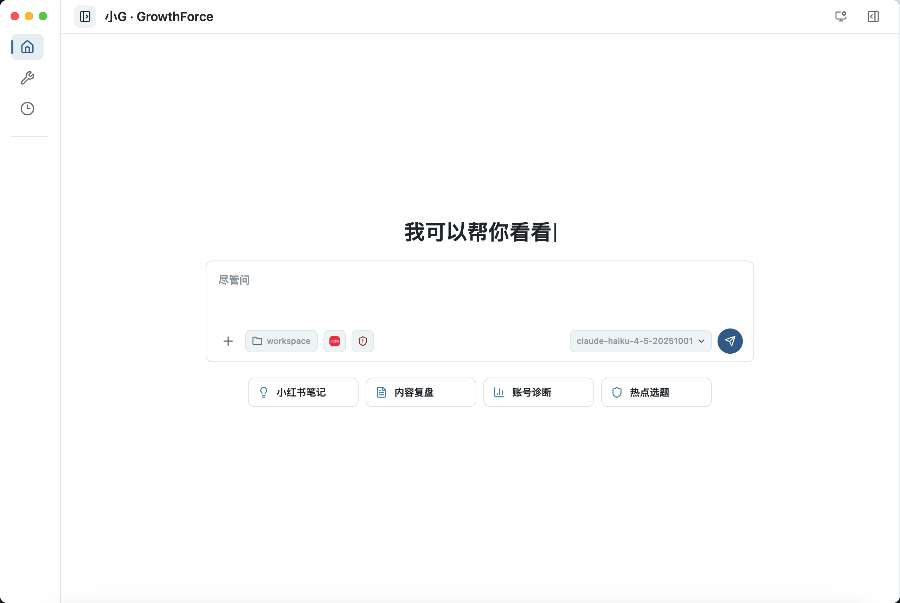
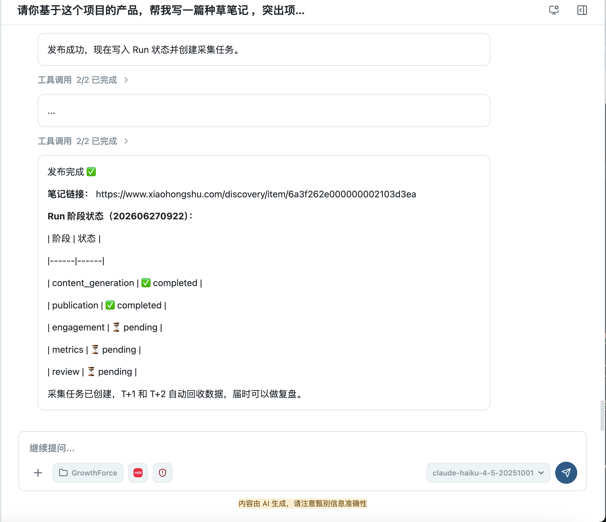
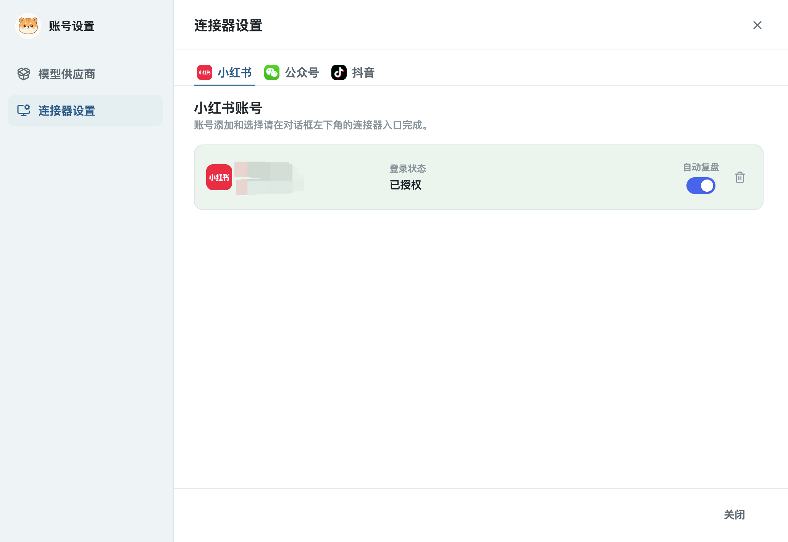
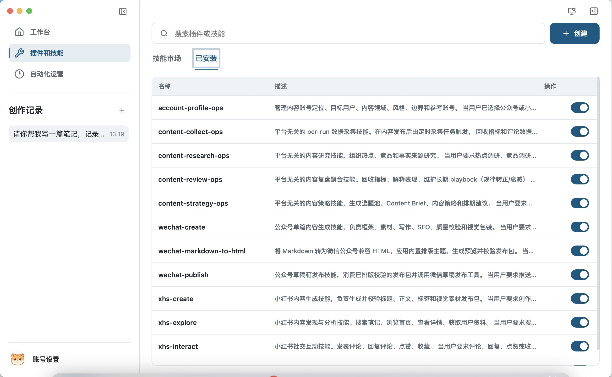
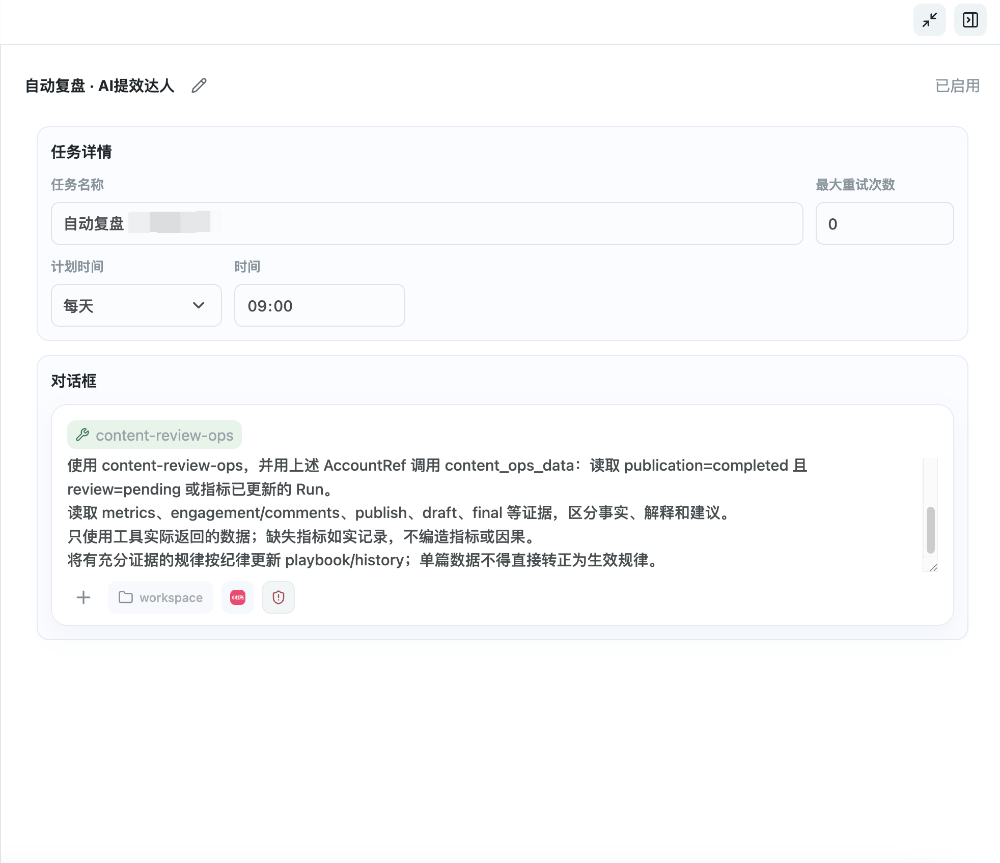

<h1 align="center">GrowthForce</h1>

<p align="center">
  <strong>AI 驱动的矩阵账号内容运营工作台</strong><br/>
  一键安装，开箱即用。无需配置 Codex，无需搭建工作流。
</p>

<p align="center">
  <a href="./LICENSE">
    
  </a>
  
  
</p>

<p align="center">
  <a href="./README.en.md">English</a> · <a href="#产品截图">产品截图</a> · <a href="#快速开始">快速开始</a> · <a href="#核心优势">核心优势</a> · <a href="#愿景与合作">愿景与合作</a>
</p>

---

## 产品截图











---

## 为什么选择 GrowthForce

大多数 AI 写作工具只解决"生成一篇内容"这一个环节。但内容运营的真正难点在于：

- 多个账号同时运营，内容定位各不相同
- 每天重复"找热点 → 写内容 → 发布 → 看数据"的流程
- 历史数据和经验无法沉淀，每次创作从零开始

GrowthForce 不是又一个 AI 写作助手。它是一个**完整的内容运营操作系统**——从矩阵账号管理到自动化发布、从数据采集到 AI 复盘，一个桌面应用全部搞定。

---

## 核心优势

### 矩阵账号管理

同时运营多个小红书、公众号账号，每个账号独立维护定位、人设、内容策略和运营 Playbook。不再在多个浏览器窗口之间切换。

### 全自动运营闭环

```
账号定位 → 热点研究 → 选题排期 → 内容生成 → 平台适配 → 发布 → 数据采集 → AI 复盘 → 策略更新
```

设置好账号定位后，GrowthForce 自动执行完整运营链路。定时任务驱动数据采集和复盘，每次发布的效果自动沉淀为下一次创作的输入。

### AI 驱动复盘

不只是看数据面板。AI Agent 自动分析每篇内容的表现（阅读、点赞、收藏、评论），对比初稿与终稿差异，总结有效模式，更新账号的长期运营 Playbook。单篇噪声不会干扰判断——只有经过多篇验证的规律才会转正生效。

### 一键安装，开箱即用

从 [GitHub Releases](https://github.com/veloforce/GrowthForce/releases/) 下载安装包，按平台选择对应文件：

- **macOS**：下载 DMG（Apple Silicon / Intel 按设备架构选择）
- **Windows**：下载 EXE

下载后双击安装，打开即用。

- **无需安装 Codex** — Agent 运行时内置
- **无需配置工作流** — 预置完整的内容运营 Skill 和 Tool
- **无需搭建环境** — 小红书连接器、浏览器引擎、数据库全部打包在内
- **无需编程经验** — 对话式交互，说人话就能操作

---

## 快速开始

打开应用后，只需要两步：

### 1. 配置 AI 模型

填写 Claude Code 适配的模型和 API 配置（模型名称、API Key、Base URL 等）。

### 2. 连接自己的账号

连接你要运营的平台账号（小红书 / 公众号），即可开始使用。

### 开始运营

直接对 AI 说你想做什么：

> "帮我研究一下最近小红书上关于 AI 工具的热点，给我出 3 个选题"

> "按第二个选题写一篇小红书笔记，口语化一点，带互动引导"

> "发布到我的小红书账号，明天下午 6 点定时发"

> "看看上周发的内容数据怎么样，哪篇效果最好"

---

## 功能全景

| 阶段 | 能力 | 状态 |
|------|------|------|
| 账号定位 | 多账号管理、人设定位、策略差异化 | ✅ |
| 热点研究 | 平台热点追踪、竞品分析、可借势角度 | ✅ |
| 内容创作 | 小红书笔记、公众号长文、多平台适配 | ✅ |
| 视觉包装 | 封面文案、配图思路、排版优化 | ✅ |
| 发布管理 | 一键发布、定时发布、多账号分发 | ✅ |
| 数据采集 | 自动定时采集阅读/点赞/收藏/评论 | ✅ |
| AI 复盘 | 效果归因、模式识别、Playbook 沉淀 | ✅ |
| 互动运营 | 评论回复、点赞收藏 | ✅ |
| 自动化任务 | 定时采集、定时复盘、定时发布 | ✅ |
| 公众号连接 | 草稿箱推送、文章排版 | ✅ |
| 小红书连接 | 笔记发布、数据采集、互动 | ✅ |

---

## 架构

```
GrowthForce Desktop
├─ Renderer          用户界面 · 对话工作台 · 任务管理
├─ Main Process      窗口 · 会话 · 数据 · 调度
├─ Agent Runtime     AI Agent 执行 · Skill 编排
│   ├─ Skills        内容研究 / 创作 / 发布 / 采集 / 复盘
│   └─ Tools         文件 · 图片 · 浏览器 · 自动化 · 数据
└─ Connectors        小红书 · 公众号（可扩展）
```

**设计原则：**
- **本地优先** — 数据存储在本地，隐私可控
- **Agent 架构** — 三层解耦：Agent 理解目标 → Skill 定义 SOP → Tool 执行原子操作
- **人机协同** — 对外发布和互动强制用户确认，适合需要品控的团队

---

## 愿景与合作

### 我们的愿景

**让每个内容创作者都拥有一支 AI 运营团队。**

内容运营不应该是重复劳动。研究、写作、发布、看数据、总结经验——这些环节的 80% 工作可以由 AI Agent 完成，创作者只需要做决策和把关质量。

GrowthForce 的目标是成为内容运营领域的基础设施：开源、可扩展、社区驱动。

### 合作方向

我们欢迎以下方向的合作：

| 方向 | 说明 |
|------|------|
| **平台连接器** | 接入更多内容平台（抖音、B站、Twitter/X、LinkedIn 等） |
| **Skill 贡献** | 贡献特定领域的运营方法论（电商、知识付费、本地生活等） |
| **AI 能力增强** | 更好的内容理解、数据分析、趋势预测能力 |
| **商业合作** | MCN、运营服务商、SaaS 平台集成 |
| **国际化** | 多语言支持、海外平台适配 |

### 为什么开源

- 内容运营的方法论应该共建共享，而不是封闭在某个产品里
- 开源让用户可以审计 Agent 行为，确保透明可控
- 社区贡献的平台连接器和 Skill 能让所有用户受益

---

## 开发

```bash
# 克隆仓库
git clone https://github.com/veloforce/GrowthForce.git
cd GrowthForce

# 安装依赖
npm install

# 启动开发环境
npm run dev

# 构建
npm run build

# 打包
npm run package:mac        # macOS 通用
npm run package:mac:arm64  # Apple Silicon
npm run package:win        # Windows
```

### 项目结构

```
src/
├── main/          Electron 主进程
├── renderer/      React 渲染进程
├── agent/         Agent 运行时
├── preload/       预加载脚本
└── shared/        共享类型和工具

resources/
├── agents/        Agent 定义
├── skills/        Skill 定义（SOP 和编排）
├── tools/         Tool 实现（原子能力）
├── connectors/    平台连接器
└── prompts/       提示词模板
```

### 技术栈

- **桌面框架**: Electron
- **前端**: React + Vite + TypeScript
- **AI 运行时**: Claude Agent SDK
- **数据存储**: sql.js (SQLite in WASM)
- **自动化**: 内置浏览器引擎 + CDP
- **平台连接**: Python sidecar (小红书)

---

## 路线图

- [ ] 更多平台连接器（抖音、B站）
- [ ] 多账号并行运营面板
- [ ] 内容日历与排期可视化
- [ ] Skill 市场（社区贡献的运营方法论）
- [ ] 团队协作模式
- [ ] 移动端配套（审批、快速发布）

---

## 许可证

[Apache License 2.0](./LICENSE)

---

<p align="center">
  <strong>用 AI 让内容运营从重复劳动变成创造性决策。</strong>
</p>
